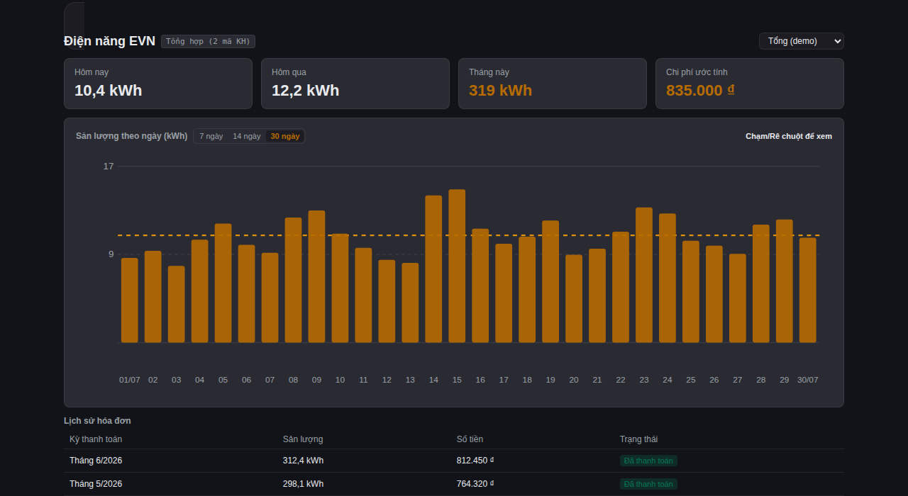

# EVN Vietnam for Home Assistant

EVN Vietnam is a HACS custom integration for monitoring electricity use, estimated cost, and official EVN bill history from an EVN CSKH account. It supports already-linked customer codes and a local aggregate in Home Assistant.



For Vietnamese instructions, see [README_VN.md](README_VN.md).

## Features

- HACS custom integration with Config Flow.
- Per-meter sensors and an optional local aggregate.
- Username and password stored in the Home Assistant Config Entry; token refresh, silent re-login, and an 8-minute session keepalive.
- Lovelace card registered automatically through `extra_module_url` and an EVN Energy panel dashboard.
- Daily chart with one calendar column per day for 7, 14, and 30-day ranges, including unreported days.

## Requirements

- Home Assistant 2024.8+ (including current 2026.x releases).
- HACS.
- An EVN CSKH national-app account.
- Customer codes already linked in the EVN app account. `PB000001` is an example only.

## Install with HACS

1. In HACS, open **Integrations** → the three-dot menu → **Custom repositories**.
2. Add `https://github.com/im-vinhawk/evn-add-on` as an **Integration** repository.
3. Search for **EVN Vietnam**, install it, and restart Home Assistant.
4. Go to **Settings → Devices & services → Add integration**, then choose **EVN Vietnam**.

This is a custom repository; it is not yet available in the default HACS store.

## First-run configuration

Enter the phone/login identifier and password used for the EVN CSKH national app. Home Assistant stores both in the Config Entry so this integration can refresh or silently restore its EVN session.

Treat Home Assistant backups and Config Entry storage as sensitive: they contain the password. Do not paste credentials into YAML, dashboards, issue reports, logs, or screenshots.

## Extra customer codes and aggregate selection

Open **Settings → Devices & services → EVN Vietnam → Configure**.

Add only customer codes that are already linked to the same EVN account, then select the codes included in the local aggregate. The primary account remains included; each configured meter still has its own sensors.

## Dashboard

Copy [docs/evn-dashboard.example.yaml](docs/evn-dashboard.example.yaml) into a YAML dashboard and replace every `sensor.evn_*` placeholder with entity IDs shown in **Developer Tools → States**. The example uses `type: panel` so the card gets the full width it needs.

## Lovelace card notes

The integration registers `/evn_vietnam/evn-vietnam-energy-card.js` through Home Assistant's `extra_module_url`. In the default storage-mode dashboard, `lovelace.resources` in `configuration.yaml` is ignored, so do not add a duplicate YAML resource to repair a card-loading problem.

The card uses the selected month sensor's `daily_history`. Check that sensor first if the chart is empty.

## Security

- Never commit or share passwords, tokens, JWTs, Home Assistant backups, raw EVN responses, customer names, phones, or customer rosters.
- Use Home Assistant's authenticated UI and API for inspection; do not expose the card path through an unauthenticated public reverse proxy.
- Diagnostics redact credentials and session tokens.

## Calculation contract

The aggregate is calculated locally:

- kWh is the sum of successful per-meter kWh.
- Estimated cost is the sum of each meter's tier estimate; the tariff is never recalculated from aggregate kWh.
- Official bills are the sum of EVN `TONG_TIEN` values for the same period.
- A failed meter is surfaced as a partial aggregate rather than silently treated as zero.

## Known limitations

- EVN OTP and linking a new customer are not supported because the upstream flow currently fails with an NPE.
- The integration cannot automatically list every customer code linked through iOS because EVN provides no suitable list API.
- Home Assistant Energy Dashboard may still warn about `state_class` (`measurement` versus `total`).
- Installation requires adding this repository as a HACS custom repository.

## Agent prompt

Use [docs/agent-setup-prompt.md](docs/agent-setup-prompt.md), or copy this prompt:

```text
Set up EVN Vietnam from https://github.com/im-vinhawk/evn-add-on as a Home Assistant HACS custom integration. Read README.md and README_VN.md first. Add the repository in HACS as an Integration custom repository, install EVN Vietnam, and restart Home Assistant. In Settings → Devices & services, add EVN Vietnam and enter the EVN CSKH national-app login identifier and password only in the Config Flow. Do not put credentials in YAML.

Use Configure on the EVN integration to add only customer codes already linked to the same EVN account and choose the local aggregate selection. Discover the created entities in Developer Tools → States; do not guess entity IDs. Copy docs/evn-dashboard.example.yaml into a YAML dashboard, replace every sensor.evn_* placeholder with the discovered entities, and keep type: panel. The Lovelace card is auto-registered at /evn_vietnam/evn-vietnam-energy-card.js through extra_module_url. In storage-mode dashboards, lovelace.resources YAML is ignored, so do not add a duplicate resource.

Verify that per-meter sensors and the selected aggregate are available, that the aggregate follows the documented calculation contract, and that the card chart has one calendar column per day for 7, 14, and 30-day ranges. Never print, log, commit, or copy passwords, tokens, JWTs, raw EVN responses, phone numbers, customer names, customer codes, or bill data. Report only redacted status and counts. Do not attempt EVN OTP/link-new-customer, automatic iOS-linked-code discovery, or an Energy Dashboard state_class workaround; see the READMEs for current limitations.
```

## Development

```sh
pytest -q
node --check custom_components/evn_vietnam/www/evn-vietnam-energy-card.js
node tests/test-evn-vietnam-energy-card-render.js
```
