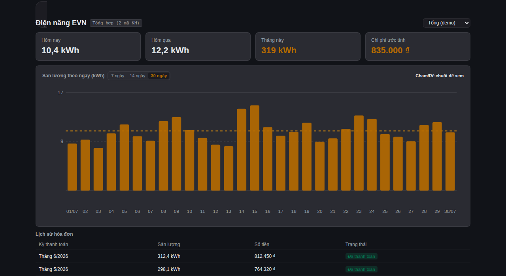

# EVN Vietnam for Home Assistant

EVN Vietnam is a HACS custom integration for monitoring electricity use, estimated cost, and official EVN bill history from an EVN CSKH account. It supports already-linked customer codes and a local aggregate in Home Assistant.



For Vietnamese instructions, see [README_VN.md](README_VN.md).

## Features

- HACS custom integration with Config Flow.
- Per-meter sensors and an optional local aggregate.
- Username and password stored in the Home Assistant Config Entry; token refresh, silent re-login, and an 8-minute session keepalive.
- Lovelace card registered automatically through `extra_module_url` and an EVN Energy panel dashboard.
- Daily chart with one calendar column per day for 7, 14, and 30-day ranges ending today, including unreported days, and a month picker (the current month and the 12 before it).
- Optional nickname per customer code, shown in the card.
- Daily kWh and estimated cost kept as long-term statistics for the Energy dashboard, plus a day-versus-last-month tile in the card.
- Bills and meter readings keep their last good copy when an EVN request fails.
- Each bill's kWh is checked against the collected daily kWh, and every new billing period fires the `evn_vietnam_bill` event.
- Bills that still await payment are read next to the paid history: every bill has its real payment state (`paid`, `unpaid` or `unknown`, never a default "paid"), its due date and the amount still owed, and a bill is announced when EVN issues it, not after it is paid.
- Planned power outages for the next 14 days, a projection of the running billing period's cost with a warning before the next price tier, and a card with four layouts (`mode`) for a four-tab dashboard.

## Requirements

- Home Assistant 2024.8+ (including current 2026.x releases).
- HACS.
- An EVN CSKH national-app account.
- Customer codes already linked in the EVN app account. `PB000001` is an example only.

## Install with HACS

1. In HACS, open **Integrations** → the three-dot menu → **Custom repositories**.
2. Add `https://github.com/im-vinhawk/evn-add-on` as an **Integration** repository.
3. Search for **EVN Vietnam**, install it, and restart Home Assistant.
4. Go to **Settings → Devices & services → Add integration**, then choose **EVN Vietnam**.

This is a custom repository; it is not yet available in the default HACS store.

To update, open **EVN Vietnam** in HACS, choose **Update information**, then **Update**, and restart Home Assistant.

## First-run configuration

Enter the phone/login identifier and password used for the EVN CSKH national app. Home Assistant stores both in the Config Entry so this integration can refresh or silently restore its EVN session.

Treat Home Assistant backups and Config Entry storage as sensitive: they contain the password. Do not paste credentials into YAML, dashboards, issue reports, logs, or screenshots.

## Extra customer codes and aggregate selection

Open **Settings → Devices & services → EVN Vietnam → Configure**.

Add only customer codes that are already linked to the same EVN account, then select the codes included in the local aggregate. The primary account remains included; each configured meter still has its own sensors.

## Nicknames

Saving the options above continues to a **Nicknames** step with one optional field per customer code (up to 30 characters; leave it blank for none). Nicknames are stored in the integration's options, never sent to EVN, and exposed as the `customer_alias` attribute. The card shows `nickname (code)` in the dropdown and header, and statistic names use the nickname or the last four digits of the code.

## Long-term statistics and the Energy dashboard

Every refresh stores each code's daily kWh and publishes it as Home Assistant long-term statistics (source `evn_vietnam`), so history is kept by date instead of by fetch time:

- `evn_vietnam:<code>_daily_energy` and `evn_vietnam:<code>_daily_cost` per customer code, with the code in lower case, for example `evn_vietnam:pb000001_daily_energy`.
- `evn_vietnam:total_daily_energy` and `evn_vietnam:total_daily_cost` for the selected codes when two or more are selected. They are rebuilt when the selection changes.
- Names are `EVN <nickname or …last four digits> daily energy` and `… daily cost (estimate)`; the full customer code is not part of a name.

The `current_month_consumption` sensor shows its ids in the attributes `statistics_id` and `cost_statistics_id`.

To use them in the Energy dashboard: **Settings → Dashboards → Energy → Electricity grid → Add consumption**, pick an `EVN … daily energy` statistic, and for cost choose **Use an entity tracking the total costs** and pick the matching `… daily cost (estimate)`. The cost statistic is in VND, so the Home Assistant currency must be VND. Use either the total or the per-code statistics, not both, or the same kWh is counted twice. Developer Tools → Statistics lists them too.

How history is filled:

- The days of the current month are merged on every refresh. During the first five days of a month the previous month is fetched again once a day, because EVN can still correct it. While the previous month's last day is missing or still a provisional 0, the previous month is also fetched again every three hours until the 10th, so a day EVN publishes late is not lost.
- After a restart, older days are fetched during the regular refreshes, which can take up to a minute longer while it runs: one customer code per refresh, at most six months per refresh, with a pause of at least two seconds before every request. It goes back at most 36 months, stops at the first two empty months in a row, and stops for the moment on any EVN error, then resumes on the next refresh; a code whose requests fail goes behind the others. The first refresh after a restart neither backfills nor looks at the previous month, so startup is not held up.
- Diagnostics list the oldest stored day per code (with masked codes) and whether the backfill finished.

Limits:

- There is one point per day, at local midnight, so use the day, week, month or year view; the hourly view says nothing.
- EVN reports each day about a day late. A zero reading for yesterday or today is treated as "not reported yet" and gets no point until EVN reports it.
- Cost is an estimate, priced with the method in `estimate_method` below. It is not a bill.
- Statistics are rebuilt whole from the stored days on every change, so they follow corrections from EVN. Statistics and backfill errors are logged at debug level and never stop the sensors from updating.

## Dashboard

Copy [docs/evn-dashboard.example.yaml](docs/evn-dashboard.example.yaml) into a YAML dashboard and replace every `sensor.evn_*` placeholder with entity IDs shown in **Developer Tools → States**. The example uses `type: panel` so the card gets the full width it needs.

## Lovelace card notes

The integration registers `/evn_vietnam/evn-vietnam-energy-card.js` through Home Assistant's `extra_module_url`. In the default storage-mode dashboard, `lovelace.resources` in `configuration.yaml` is ignored, so do not add a duplicate YAML resource to repair a card-loading problem.

The card uses the selected month sensor's `daily_history`. Check that sensor first if the chart is empty.

`daily_history`, `today_consumption` and `yesterday_consumption` come from the last 31 days of the stored daily kWh plus the rows of the current refresh, so on the 1st of a month they still cover the month before. `yesterday_consumption` is unknown (`unknown` in Home Assistant, `—` in the card) while EVN has not published that day; it is never a made-up 0, and the aggregate's yesterday is unknown while any selected code's is.

The default chart shows the last 30 days ending today in Home Assistant's calendar; a day EVN has not published yet is drawn as a gap. The drop-down above the chart switches to one calendar month (the current month and the 12 before it): the month is read once from the statistics above, shown with its total, and, for each bill of that month, one line `Hoá đơn … kWh · Thu thập … kWh · Lệch … kWh · <status>`. The choice is kept only while the card is open.

Below the summary, a tile compares the selected day with the same day of the previous month and with the previous month's daily average, for kWh and, when available, cost. The day defaults to the latest day with data; click a chart bar to pick another. A missing day shows `—`, never 0, and the 29th to 31st have no counterpart in a shorter month. The tile reads the statistics above; without them it shows a muted "Chưa có lịch sử".

### Card layouts (`mode`)

The card takes an optional `mode`, so a dashboard can use one card per tab. [docs/evn-dashboard-tabs.example.yaml](docs/evn-dashboard-tabs.example.yaml) is a four-view dashboard.

| `mode` | Shows |
|---|---|
| `overview` | a banner for unpaid bills (count, total owed, earliest due date, a link to `bills_path`) and for a planned outage within 7 days; the newest day, the month so far, the projection of the running period ("dự kiến", with the tier hint) and the latest reconciliation; one row per code |
| `usage` | the latest-day and month tiles, or, for a month picked in the drop-down, its total, electricity bill (the bill when there is one, otherwise "≈" from the cost statistics), daily average and busiest day; then the daily chart |
| `bills` | for a chosen billing period: per code the period, bill kWh, collected kWh, difference, result (Khớp, Lệch, Chưa đủ ngày), amount and payment state, and the totals |
| `meter` | per code the start and end index of the newest period, its closing date and kWh, and the latest daily index |

Without `mode`, or with an unknown value, the card keeps the layout it always had. In every layout a month with no day of data reads "Chưa có số · EVN đăng trễ ~1 ngày" instead of 0, "Hôm nay" is replaced by "Ngày mới nhất (dd/mm)", and a payment state EVN did not give reads "Không rõ". `bills_path` (for example `/evn-energy/hoa-don`) is only linked when it is a path inside Home Assistant.

In the `bills` layout the kWh totals add up only the codes whose result is Khớp, Lệch or Lệch ranh giới with finite bill, collected and difference figures; every other code is named under the tiles with its reason ("chưa đủ ngày (n/N)", "chưa có kWh hoá đơn", "không kiểm được" …). The amount total adds every bill amount that is a number. Tables stack as label/value cards on a narrow container (a phone). The tabs name a code by its view `label`, its nickname, or `customer_N`; they never print the code.

## Security

- Never commit or share passwords, tokens, JWTs, Home Assistant backups, raw EVN responses, customer names, phones, or customer rosters.
- Use Home Assistant's authenticated UI and API for inspection; do not expose the card path through an unauthenticated public reverse proxy.
- Diagnostics redact credentials, session tokens and the device id, and replace every customer code with an alias (`customer_1`, …), so the file is safe to attach to an issue.

## Calculation contract

The aggregate is calculated locally:

- kWh is the sum of successful per-meter kWh.
- Estimated cost is the sum of each meter's own estimate; the tariff is never recalculated from aggregate kWh.
- Official bills are the sum of EVN `TONG_TIEN` values for the same period.
- A failed meter is surfaced as a partial aggregate rather than silently treated as zero.
- Bill kWh comes from EVN's monthly meter readings, matched to each bill by month and period; when a reading is missing, `total_kwh` is unknown (`null`, shown as `—`), never 0.
- In the aggregate bill table, a period's `total_kwh` and `calculated_amount` are `null` as soon as one meter's bill in that period has none, so a partial sum never looks complete. A meter with no bill for a period does not count.

### Last good history

The bills and monthly readings of each code are kept in memory. If EVN fails, the last successful copy (of any age) is shown instead of a blank or shorter history; a closed bill does not change, so it is as correct as a fresh one. Only a code that has never been read successfully shows nothing. The `history_fetched_at` attribute of `current_month_consumption` is the time of the successful fetch the shown history came from (for the aggregate, the oldest among its codes). A meter whose live data failed stays in `partial_errors`, but the aggregate history keeps its last good bills. Nothing is written to disk, so a restart while EVN is down starts empty.

### Tariff

Estimated cost and each bill's `calculated_amount` use the EVN residential tariff in force on each day: the table effective 2025-05-10 (evn.com.vn, VAT 8 %) and the earlier rows back to 2023-11-09. A month that contains a price change is split by days the way EVN bills it. `calculated_amount` sits next to the real `total_amount` in `monthly_history` and `bills`; when the two start to differ, a price change is missing: add one row with its effective date to `custom_components/evn_vietnam/tariff.py`. Only whole calendar months from 2023-11-09 are modelled; any other period shows `calculated_amount: null`.

### Tariff check per code

The tier model is trusted only where it reproduces that code's real bills. The attribute `tariff_verified` of `current_month_amount` compares `calculated_amount` with `total_amount` on the latest three closed bills that the model can price and that were billed for more than 0 VND:

- all equal: `true`, and the estimate uses the tier model (`estimate_method: tiered`);
- any differ: `false`, and the estimate is the month's kWh times the code's effective price, the total paid divided by the total kWh of its latest three bills with known kWh (`estimate_method: effective_price`);
- no bill to compare: `null`, treated as the tier model.

A code billed on another price schedule, or any code after a price or VAT change that `tariff.py` does not list yet, therefore switches to `effective_price` by itself. Adding the missing row to `tariff.py` switches it back once its latest bills match again. The aggregate shows `tariff_verified: false` when any selected code is `false` and `estimate_method: effective_price` when any selected code uses it; its estimate is still the sum of the per-code estimates. `calculated_amount` in the bill history always stays the pure tier calculation, as the comparison.

### Bill check against the collected days

Each billing period of a code (month plus period number; several invoices of one period are combined) is compared with the stored daily kWh. On the account this was measured on, a bill for the period `[start, end]` agrees with the daily rows dated `start − 1 day` to `end − 1 day`, as if EVN dated each daily row one day before the consumption it holds; that is the window compared (`BILL_DAY_OFFSET` in `const.py`). On the data this was built against that window agreed with the bill within 1 kWh far more often than the period as EVN states it. Another EVN region might date its rows differently; if most bills of a code fall outside the tolerance, the offset needs to become an option.

`collected_kwh` is the sum of the stored days of the window and `diff_kwh = collected_kwh − bill kWh`. `missing_days` counts the window days that are not stored; it is reported with every status. The status is the first rule that applies:

| Status | Meaning |
|---|---|
| `no_kwh` | the bill's kWh or its period dates are not known yet |
| `match` | the difference is within the tolerance |
| `boundary` | two adjacent periods, both with every day stored, differ in opposite directions and cancel within the tolerance: EVN cut the period one day off and the energy moved between two bills. Shown on both periods |
| `incomplete` | days are missing from the window and the difference is above the tolerance |
| `mismatch` | every day is stored and the difference is above the tolerance |

The tolerance is the option **Bill check tolerance (kWh)** (Configure; 0 to 100, default 1.0). Every bill row in `monthly_history` and `bills` carries `year`, `month`, `ky`, `collected_kwh`, `diff_kwh`, `missing_days`, `reconcile_status` and `paired_with`; only the first invoice of a period carries the result. In the aggregate they are sums, null as soon as one code that billed the period has no value, with the worst status of the codes. The card shows `Thu thập` and `Lệch` columns in the bill table.

### New-bill event

The first time a billing period is seen, the integration fires one Home Assistant event, `evn_vietnam_bill`. Within ten days of that, a change of the period's status or amount (for example an `incomplete` period that becomes `match` once a late day arrives, or a second invoice) fires one more with `reason: update`. After ten days the period is frozen.

| Field | Meaning |
|---|---|
| `bill_id` | opaque 12-character id of this period of this code; use it as the notification id |
| `entry_id` | the config entry |
| `label` | the nickname, or the last four characters of the code when the nickname is empty or holds something code-like |
| `period`, `ky` | `MM/YYYY` and the period number |
| `period_start`, `period_end` | the period as EVN states it |
| `window_start`, `window_end` | the daily rows compared |
| `bill_kwh`, `collected_kwh`, `diff_kwh`, `missing_days` | the check (numbers can be `null` while `status` is `no_kwh`) |
| `status`, `previous_status` | the status now and at the previous notice (`null` for `new`) |
| `reason` | `new` or `update` |
| `compensates_previous` | `true` when the period is the later half of a `boundary` pair |
| `total_amount`, `calculated_amount` | the bill's VND (summed over its invoices) and the add-on's own price |
| `threshold_kwh` | the tolerance used |
| `payment_status`, `due_date`, `amount_owed` | the payment state, the due date (`null` when unknown) and the amount still owed (`null` when unknown) |

The event never carries the customer code. Delivery is at most once: the seen state is saved before the event is fired, so a crash in between loses that one notice rather than repeating it. Only a fresh bill list counts; a cached copy (EVN failing) never seeds or fires. On the first fresh list after installing or upgrading, older periods are recorded silently and only the previous calendar month or later is announced; the same holds the first time the unpaid list is read, so upgrading from 0.4.0 does not announce old arrears. A bill is announced when EVN issues it (while it is still unpaid), and paying it later is not news: it fires nothing.

```yaml
automation:
  - alias: EVN bill notice
    trigger:
      - platform: event
        event_type: evn_vietnam_bill
    action:
      - service: persistent_notification.create
        data:
          notification_id: "evn_bill_{{ trigger.event.data.bill_id }}"
          title: "EVN bill {{ trigger.event.data.period }} – {{ trigger.event.data.label }}"
          message: >-
            Bill {{ trigger.event.data.bill_kwh }} kWh, collected {{ trigger.event.data.collected_kwh }} kWh,
            difference {{ trigger.event.data.diff_kwh }} kWh ({{ trigger.event.data.status }}).
```

### Payment state and unpaid bills

EVN lists a bill in its history only once it is paid, so the add-on also reads the list of bills awaiting payment (`tracuu/hoadon-thanhtoan`) and merges the two by billing period (year, month, period number).

- Every bill row carries `payment_status` (`paid`, `unpaid` or `unknown`), `is_paid` (`true`, `false` or `null`), `due_date`, `amount_owed` (what is still to pay), `paid_on` and `payment_checked`. EVN's status code decides (`DATT` paid, `CHUATT` unpaid); a payment date also proves `paid`; anything else is `unknown`, never "paid".
- A period in the fresh unpaid list stands for itself. A paid history row beats an unpaid row that is only a cached copy (a bill paid between two polls reads `paid`). A cached unpaid row nothing contradicts stays `unpaid` with `payment_checked: false`; the card says "chưa kiểm lại".
- The unpaid list is asked for at most once every two hours per code and once after a start; when EVN fails the last good copy stands in. A code whose unpaid list cannot be read at all appears in `partial_errors` as `unpaid_bills`, keeps the rest of its data, and has `unknown` payment states.
- Sensors per code and for the total: `unpaid_amount` (VND still owed; `0` when nothing is unpaid, unknown when the list never loaded) and `next_due_date` (a date sensor). The month sensor also carries `unpaid_count`, `unpaid_amount`, `next_due_date` and `unpaid_fresh` for the card.
- Every sensor has the attributes `evn_role` (`meter` or `aggregate`) and `evn_entry` (the config entry id). Neither identifies a person; an automation can select `evn_role == 'meter'` to get exactly one sensor per meter whatever the number of config entries.

### Planned outages

For each code the add-on asks EVN for the planned outages from today to 14 days ahead (`tracuu/ngungcapdien`), at most once every six hours, keeping the last good copy. Each code gets a `next_planned_outage` timestamp sensor (unknown when none) with the attributes `end`, `status` (EVN's short code), `upcoming_count` and `outages`, a list of `{start, end, status}` that the recorder does not store. EVN's reason, area and equipment name are free text that can name places or people, so they are dropped before anything stores them. A code whose outages cannot be read appears in `partial_errors` as `outages`; its other data stays.

### Projection of the running period

For each code the add-on estimates the bill of the period that is running now, from the stored daily kWh:

- The period starts the day after the newest known period ends. A whole calendar month is followed by the whole next calendar month; any other period by one of the same length.
- Collected kWh are the stored days of the period's window (the same one-day-earlier window as the bill check); the rate is the average of the newest seven days with data; projected kWh = collected + rate × days left.
- The amount uses the code's price model. A code on the tier model gets an amount only for a whole calendar month; any other period gets none (`projected_amount: null`) and nothing is prorated.
- For a code whose tier model is verified, in a calendar month without a price change, the projection also gives the tier reached (`tier`), the kWh left before the next tier (`kwh_to_next_tier`) and that tier's price before VAT (`next_tier_price`).

The `projected_period_amount` sensor carries these as attributes (`period_start`, `expected_end`, `data_until`, `collected_kwh`, `rate_kwh_per_day`, `projected_kwh`, `projected_amount`, `method`, `calendar_month`, `tier`, `kwh_to_next_tier`, `next_tier_price`). It has no state class, so the estimate never enters long-term statistics, and the total is unknown as soon as one code's amount is. It is an estimate, never a bill.

### Privacy of the new data

The unpaid-bill and outage rows also hold the customer's name, address, invoice id, distribution unit, meter number and meter point. None of them is copied into any attribute, event, log line, diagnostics output or test fixture; diagnostics record only the key names and value types of each raw row. The customer code stays where it already was (entity ids, device names, the `customer_code` attribute); nothing new repeats it.

## Known limitations

- EVN OTP and linking a new customer are not supported because the upstream flow currently fails with an NPE.
- The integration cannot automatically list every customer code linked through iOS because EVN provides no suitable list API.
- Home Assistant Energy Dashboard may still warn about `state_class` (`measurement` versus `total`).
- Installation requires adding this repository as a HACS custom repository.
- The bill check assumes the one-day offset above; it was measured on a single account.
- The daily history, monthly history and bills attributes are not stored by the recorder (the card reads them from the live state), which keeps every state under Home Assistant's attribute size limit.
- A bill whose kWh EVN has not published yet is announced as `no_kwh`, then updated.
- Whether every customer code of an account answers the unpaid and outage requests through the customer switch is not guaranteed; a code that does not shows `unknown` payment states and an unknown outage, never "paid".
- EVN's status codes other than `DATT` and `CHUATT` (partial payment, overdue) are shown as `unknown`.
- The projection assumes the next period is as long as the previous one (or the next calendar month); if EVN bills a different length, the expected end is off until the next bill.

## Agent prompt

Use [docs/agent-setup-prompt.md](docs/agent-setup-prompt.md), or copy this prompt:

```text
Set up EVN Vietnam from https://github.com/im-vinhawk/evn-add-on as a Home Assistant HACS custom integration. Read README.md and README_VN.md first. Add the repository in HACS as an Integration custom repository, install EVN Vietnam, and restart Home Assistant. In Settings → Devices & services, add EVN Vietnam and enter the EVN CSKH national-app login identifier and password only in the Config Flow. Do not put credentials in YAML.

Use Configure on the EVN integration to add only customer codes already linked to the same EVN account and choose the local aggregate selection. Discover the created entities in Developer Tools → States; do not guess entity IDs. Copy docs/evn-dashboard.example.yaml into a YAML dashboard, replace every sensor.evn_* placeholder with the discovered entities, and keep type: panel. The Lovelace card is auto-registered at /evn_vietnam/evn-vietnam-energy-card.js through extra_module_url. In storage-mode dashboards, lovelace.resources YAML is ignored, so do not add a duplicate resource.

Verify that per-meter sensors and the selected aggregate are available, that the aggregate follows the documented calculation contract, and that the card chart has one calendar column per day for 7, 14, and 30-day ranges. Never print, log, commit, or copy passwords, tokens, JWTs, raw EVN responses, phone numbers, customer names, customer codes, or bill data. Report only redacted status and counts. Do not attempt EVN OTP/link-new-customer, automatic iOS-linked-code discovery, or an Energy Dashboard state_class workaround; see the READMEs for current limitations.
```

## Development

```sh
pytest -q
node --check custom_components/evn_vietnam/www/evn-vietnam-energy-card.js
node tests/test-evn-vietnam-energy-card-render.js
node tests/test-evn-vietnam-energy-card-modes.js
```

`tests/test_card_layout_browser.py` opens every card layout in headless Chrome or Chromium at desktop and phone width (no horizontal scroll, stacked table rows, no empty tile) and is skipped when neither is installed.
